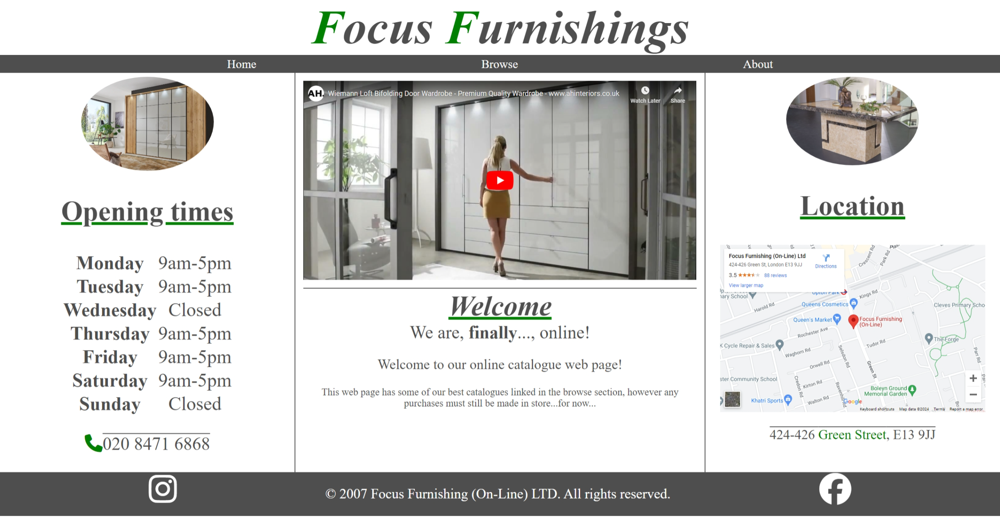
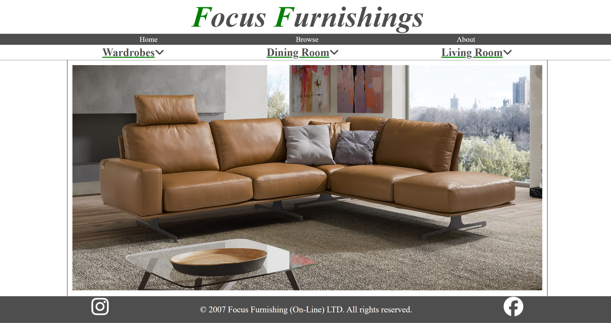
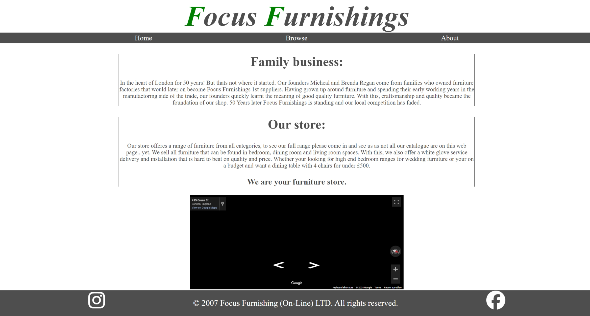

# Focus-Furnishings
### Small web page for a family run furniture retailer, who dont have much online presence.

## Purpose:
The purpose of this web page is to give the shop (Focus-Furnishings) an online presence for their customers, mainly for customers to look online at the products they have to offer.
This is important for the shop as they have gained a reputation for being oldschool being one of the only independent furniture retailers left in the area and using old methods such as sales/reciepts on paper invoices and only taking payments in store.
Hopefully with this web page customers will see that even though they are an oldschool shop, they have all the new school products and worth shopping with.
Secondly, given their small online presence and the fact there is other furnitre retailers in the area one of which shares the name "Focus", this web page will ensure customers can find the right information for this shop which is obviously very important.

## Design:

Designing the style of the webisite was challenging as alot of the bigger furniture retailers website contain moving imagery of their products as their main design which has become a very popular and is almost expectced from customers now.
However i could not implement this into this website as i could not use javascript.
So I opted for a very unique but still simple design that keeps it easy for a customer to navigate and find information but the subtle lines and colour schemes create a sleek feel to it.