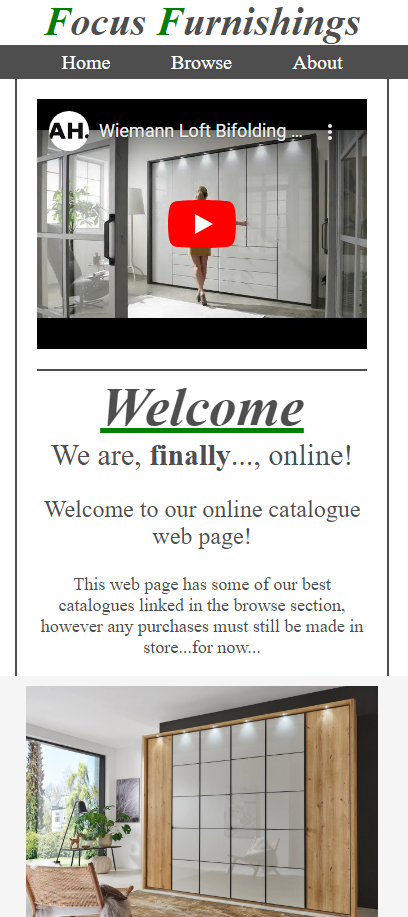

# Focus Furnishings

Focus Furnishings is a website designed for a small family run furniture retailer based in London. This website is to give Focus Furnishings an online presence. The main purpose of the website is so customers can browse some of the stores catalogues online to make it easier for them to decide if Focus has the type of products they are looking for and potentially produce sales. Also the website has important information such as contact and location deatils whcih is, of course, very important and expected so any customer who is looking for these details can now find them that much easier.

## Design:
### Page 1 (home page):

The home page's purpose is to be a nice and easy place for a user to land. At the top they will find the nav bar that will quickly take them to the browse section if they want to look at potential buys or the about if they want to read up on the company. This is important as it makes it easy for customers to get to the products section allowing quick and easy advertisement of those products. On a desktop or similar sized screen they will also have the shops phone number and adress/loaction near the footer at the bottom of the main section of the page which also holds the social links so people see it instantly and they know where it is if they need it. The social links are in the footer as it looks professional and alot of website have that type of information at the bottom so its common practice for people to navigate down the page to find and therefore makes it easier. The 1st thing that probably catches the eyes of anyone who lands on the page is the "home video" of a person opening the bifolding doors on a german wardrobe. This is important as it sets a tone of quality straight away and it is inviting people to look further into the shops products while making the shop feel honest.

### (Home page on small screens)

This is how the home page transforms on all screens smaller than 1500px. This was necessary as the larger screen size design would require much smaller text and images to work and would not be readable or look good. Still very easy to navigate with the same nav bar right at the top under the header and the social links in the footer. The shop number is moved into the footer as it wouldnt make sense for it to be anywhere else on its own whereas the large page design has the shop location and adress directly across and is all visible on the page so it looks good and makes more sense.

### Page 2 (browse page):

The browse page's purpose is, as the name implies, to help customers browse through Focus Furnishings products. When hovered over the product types, lists with imbeded links to online catalogues appear so customers can easily find the type of products they are looking for. This is important as it creates an easy way for the customers to see if Focus Furnishings are selling the type of products they are looking for and can act as good advertisement as they will be scrolling through loads of catalogues filled with furniture that can hopefully entise more sales.

### Page 3 (aboute page):

The about page is a very simple page, designed to provide some background information about Focus Furnishings for poeple who like to read up on businesses they buy from. It is important as it gives a chance for Focus to connect with the customers and persuade them that Focus Furnishings is a trustworthy shop and a good place to spend their money. There is also the iframe with a Google Maps image of the shop front which can be interacted with in the same way as on Google Maps itself. This is useful for customers as they can see what the shop looks like and where abouts on Green Street it is as it has apartments above it and can sometimes be easily missed.

## Tools: 
### I built this website using exclusivly HTML and CSS.
## Fontawesome:
I used an icon code creator online called <a href="https://fontawesome.com/" target="_blank">Fontawesome</a>. This allowed me add the facebook and instagram logo to my footer on all pages which is important and useful as the logos are instantly recognisable and look very smart as apposed to have the names written across the screen.
## VS Code:
A useful tool that iused throught the project is VS Code (Visiual Studios Code). This application is a very useful code space that makes it easier to write and store code and the best feature is easily opening a live server. The live server was an important tool for me as it makes it very easy to see what your code is producing with every change. On top of this, the short hand "emmet" can make it quicker and more efficent which is obviously a big bonus.

## Testing:

I have used dev tools on my live servers of this web page to see the pages on various screen sizes to ensure it has no issues on any screens. The HTML and CSS passed the online<a href="https://validator.w3.org/">W3C Markup validation service</a> and <a href="https://jigsaw.w3.org/css-validator/">W3C CSS validation service</a>.

